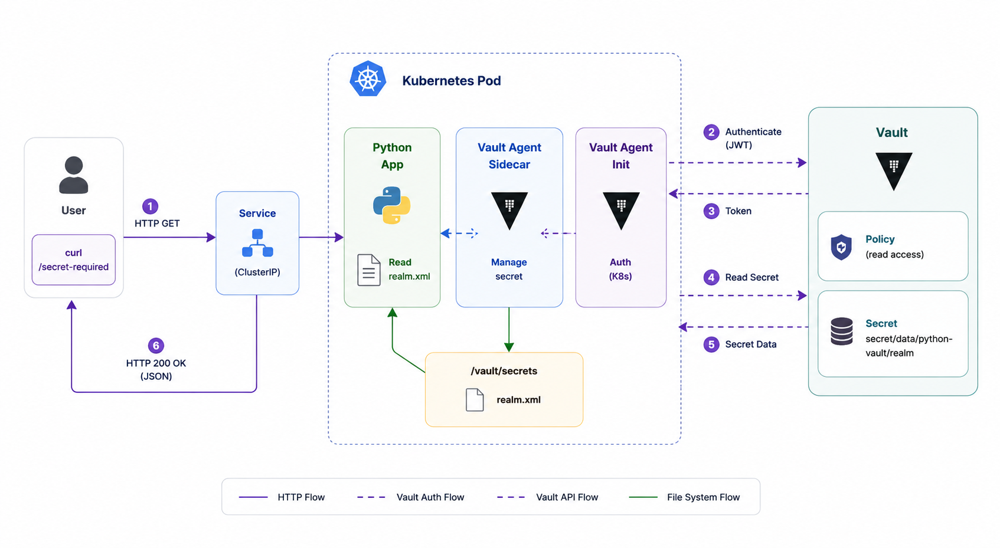

<p align="center">
  
</p>

<h1 align="center">HashiCorp Vault Python Playground</h1>

<p align="center">
An Open Source Proof of Concept demonstrating secret injection into Kubernetes Pods using HashiCorp Vault Agent Injector.
</p>

<p align="center">


</p>

---

# 📖 Overview

This Proof of Concept demonstrates how **HashiCorp Vault Agent Injector** injects secrets into Kubernetes Pods without embedding sensitive information inside container images.

A simple Python HTTP server validates that the injected secret is available at runtime.

---

# 🏗️ Architecture

<p align="center">
  
</p>

---

# 🎯 Objective

This Proof of Concept demonstrates how to:

- Deploy HashiCorp Vault on Kubernetes.
- Enable Vault Agent Injector.
- Store secrets inside Vault.
- Authenticate Kubernetes workloads.
- Inject secrets into Pods automatically.
- Access injected secrets from a Python application.

---

# ⚙️ Prerequisites

- Kubernetes Cluster
- kubectl
- Helm 3
- Docker
- Vault CLI (optional)

---

# 📦 Install HashiCorp Vault

Add the Helm repository:

```bash
helm repo add hashicorp https://helm.releases.hashicorp.com
helm repo update
```

Install Vault:

```bash
helm install vault hashicorp/vault \
  --set "server.dev.enabled=true" \
  --set "injector.enabled=true"
```

---

# 🔍 Verification

Verify that Vault is running:

```bash
kubectl get pods
```

Expected output:

```text
vault-0
vault-agent-injector-xxxxx
```

---

# 🔒 Configure Vault

Open a shell inside the Vault Pod:

```bash
kubectl exec -it vault-0 -- sh
```

Verify Vault status:

```bash
vault status
```

Enable the KV Secrets Engine:

```bash
vault secrets enable -path=secret kv-v2
```

Create the secret:

```bash
vault kv put secret/python-vault/realm \
  realm_xml='<realm><users><user><name>john</name></user></users></realm>'
```

Create the Vault policy:

```bash
vault policy write python-vault-read-policy - <<EOF
path "secret/data/python-vault/*" {
  capabilities = ["read"]
}
EOF
```

Enable Kubernetes authentication:

```bash
vault auth enable kubernetes
```

Configure Kubernetes authentication:

```bash
vault write auth/kubernetes/config \
  kubernetes_host="https://kubernetes.default.svc:443" \
  kubernetes_ca_cert=@/var/run/secrets/kubernetes.io/serviceaccount/ca.crt
```

Create the Kubernetes role:

```bash
vault write auth/kubernetes/role/python-vault-policy-role \
  bound_service_account_names=default \
  bound_service_account_namespaces=default \
  policies=python-vault-read-policy \
  ttl=1h
```

Exit the Vault Pod:

```bash
exit
```

---

# 🏗️ Build the Demo Application

Build the Docker image:

```bash
docker build -t python-vault-validation:1.0.0 .
```

If using Kind:

```bash
kind load docker-image python-vault-validation:1.0.0
```

---

# 🚀 Deploy the Demo Application

Deploy the application:

```bash
kubectl apply -f python-app-deployment.yaml
```

---

# 🔍 Verification

Verify that the Pod is running:

```bash
kubectl get pods
```

Expected output:

```text
python-vault-app-deployment-xxxxx   2/2   Running
```

Verify the injected secret:

```bash
kubectl exec deploy/python-vault-app-deployment \
  -c python-vault-container \
  -- ls -la /vault/secrets
```

Expected output:

```text
realm.xml
```

Display the injected secret:

```bash
kubectl exec deploy/python-vault-app-deployment \
  -c python-vault-container \
  -- cat /vault/secrets/realm.xml
```

---

# 🧪 Testing

Forward the application:

```bash
kubectl port-forward svc/python-vault-app-service 8080:8080
```

Verify the health endpoint:

```bash
curl http://localhost:8080/_ping
```

Expected output:

```json
{
  "status": "ok",
  "app": "python-vault-validation"
}
```

Verify the injected secret:

```bash
curl http://localhost:8080/secret-required
```

Expected output:

```json
{
  "path": "/vault/secrets/realm.xml",
  "exists": true,
  "size_bytes": 60,
  "first_80_chars": "<realm><users><user><name>john</name></user></users></realm>"
}
```

---

# 📚 What You Will Learn

After completing this Proof of Concept, you will understand how to:

- Install HashiCorp Vault using Helm.
- Enable Vault Agent Injector.
- Configure Kubernetes authentication.
- Create Vault policies and roles.
- Inject secrets into Kubernetes Pods.
- Consume injected secrets from a Python application.
- Apply Kubernetes secret management best practices.

---

# 🛠️ Troubleshooting

Authentication backend not enabled:

```bash
vault auth enable kubernetes
```

Backend configuration missing:

```bash
vault write auth/kubernetes/config \
  kubernetes_host="https://kubernetes.default.svc:443" \
  kubernetes_ca_cert=@/var/run/secrets/kubernetes.io/serviceaccount/ca.crt
```

Pod stuck during initialization:

```bash
kubectl logs deploy/python-vault-app-deployment \
  -c vault-agent-init
```

Verify the secret inside Vault:

```bash
vault kv get secret/python-vault/realm
```

---

# 🧹 Cleanup

Delete the application:

```bash
kubectl delete -f python-app-deployment.yaml
```

Uninstall Vault:

```bash
helm uninstall vault
```

---

# 📚 References

- https://developer.hashicorp.com/vault
- https://developer.hashicorp.com/vault/docs/platform/k8s/injector

---

# 🏛 About OpenMind Systems Lab

OpenMind Systems Lab is an independent French non-profit association dedicated to research, experimental development and technical benchmarking in Cloud Native technologies.

Our mission is to produce practical, reproducible and educational Open Source Proofs of Concept covering Kubernetes, Platform Engineering, Distributed Messaging, Infrastructure Security and Artificial Intelligence.

GitHub Organization:

https://github.com/openmind-systems-lab

---

<p align="center">
Made with ❤️ by OpenMind Systems Lab
</p>
